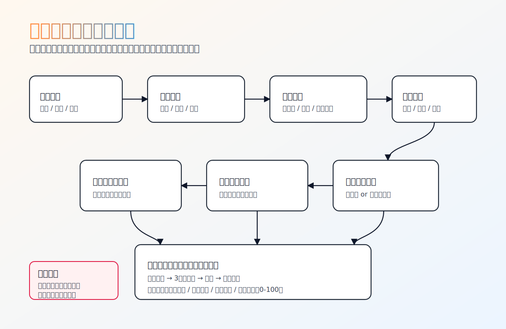

# 🌌 被蒸馏的中国人的一生

> ✦ 认真推演人生，温柔对待情绪 ✦  
> ✦ 在平行世界里，看见另一个自己 ✦

一个“认真做、好玩用”的中国语境人生模拟 skill。  
它不是算命，也不是鸡汤；它是一个可以回退、重算、对照平行世界的“人生分支引擎”。
你不是在看故事，你是在扮演“另一个你”。



## 🧭 这是什么
你输入真实处境，它把复杂人生抉择“蒸馏”为可推演分支：
- 🎓 学业路：高考/复读/职教、考研/调剂/二战止损
- 💼 就业路：稳定岗/高压平台/转行/技能重构
- 🏙️ 城市路：一线扎根/回流家乡/阶段迁移
- ❤️ 生活路：亲密关系、家庭责任、创业时机

每一步都给你一张轨迹卡：
- 📌 当前选择
- ⏳ 3年后状态
- 🧾 代价
- 🛠️ 补救动作

## 🪞 在平行世界里，成为另一个自己
这个项目最核心的体验不是“算结果”，而是“换人生”：
- 🌱 你可以把同一个起点拆成多条命运线，看到平行时空里的自己分别怎么活。
- 🔁 你可以在关键节点回退，改一个选择，观察 3 年后的人生结构如何变化。
- ⚖️ 你可以切换探索模式/现实模式，比较“理想决策”和“机会成本决策”的差异。

一句话：  
**它让你在可控的推演里，体验一次“如果当时我选了另一条路，我会是谁”。**

### 命运推演图案（流程）
`起点画像` → `选择节点` → `轨迹卡反馈` → `继续/回退` → `平行世界对照`

## 🎮 为什么它“有趣”，但不是“瞎玩”
有趣在于：
- 🎲 你可以像游戏一样继续推演，也可以随时 `回退到第N步` 看另一条命运线。
- 🌗 同一个人，在探索模式和现实模式下会出现不同后果，像在两个平行世界切换视角。
- 🎯 每一步都有明确反馈，能持续产生“再试一条线”的参与感。

认真在于：
- 🧠 内核是规则引擎 + 状态机，不是随口编故事。
- 📊 用四维评分持续量化：发展潜力、心理健康、经济压力、关系稳定（0-100）。
- 🛟 对高危表达采用安全优先，先保命再推演。
- 🧱 每条轨迹都包含代价与补救动作，不鼓励“无成本幻想”。

## 🗺️ 典型中国青年路径（首版已覆盖）
1. 升学与读研：继续冲、调剂、就业先行、二战止损
2. 职业起步：稳定现金流 vs 高压高回报 vs 主动转行
3. 城市决策：资源密度与生活负担的动态平衡
4. 关系与家庭：亲密关系协同、家庭期待协商、边界管理
5. 创业抉择：立即起步还是先积累资源

> 目标不是告诉你“唯一正确答案”，而是让你看到“你在不同选择下会成为什么样的人”。

## 🎬 一个真实感样例（考研/调剂/就业）
起点：本科普通、二战后压力大、家庭希望尽快稳定。  
你可以同时推三条平行线：
- A 线：继续冲名校三战  
- B 线：接受调剂先读，再用实习补专业差距  
- C 线：暂停升学先就业，1 年后再评估读研  

系统不会直接告诉你“哪条绝对正确”，而是给出每条线的：
- 3 年后位置
- 现实代价
- 心理负荷
- 可执行补救动作

你最后得到的不是鸡血，而是“看过多条命运线后，仍然愿意承担的那个选择”。

## 🚀 快速开始

### 本地验证
```bash
python -m engine verify
pytest -q
```

### ✨ 一键安装（面向不会用 skill 的用户）
- macOS
```bash
bash scripts/install.sh
```

- Windows PowerShell
```powershell
powershell -ExecutionPolicy Bypass -File scripts/install.ps1
```

安装成功后，脚本会打印一条可复制启动命令。

## 📦 仓库结构
- `SKILL.md`：对话协议与行为规则
- `engine/`：Python 状态机引擎
- `data/rules.yaml`：人生分支规则库
- `scripts/`：安装与自检脚本
- `tests/`：自动化测试
- `docs/releases/`：版本发布说明

## 🛡️ 安全与边界
- 高危表达（如“活不下去”“想伤害自己”）会立即暂停剧情，进入危机支持流程。
- 心理健康分低于阈值时会强制插入稳定动作建议。
- 本项目用于决策辅助和情绪支持，不替代专业医疗、法律与财务建议。

## 📣 发布资料
- 版本日志：`CHANGELOG.md`
- v0.1.0 发布说明：`docs/releases/v0.1.0.md`
- 发布检查清单：`docs/release-publish-checklist.md`
- 演示视频脚本：`docs/demo-video-script.md`

## 🧩 Troubleshooting
详情见：`docs/troubleshooting.md`
